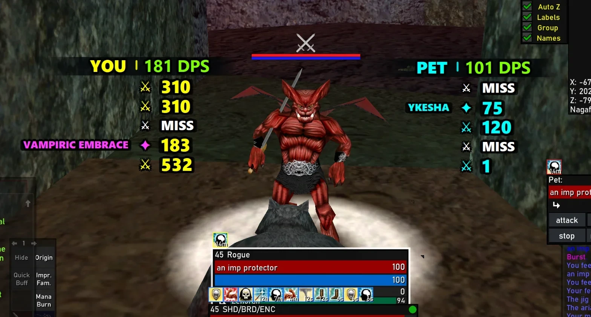

# EQL Combat Feed

A focused outgoing-damage overlay for **EverQuest Legends**: clean hits and
encounter DPS directly over the game, without adding another dashboard window.



## Why this exists

There are already plenty of EverQuest damage parsers. Many are excellent, and many
also grow into full applications: tables, charts, breakdowns, reports, encounter
browsers, overlays, meters, exports, and twenty other features living in another
window on an already crowded screen.

EQL Combat Feed deliberately does not compete with that.

It was built for one simple job: show each outgoing hit clearly while you play, with
an immediate encounter DPS number beside it. No parser dashboard to manage. No giant
opaque panel covering the game. No bundled combat-analysis suite.

**Damage and DPS. That's it.**

## What it does

- Shows outgoing **YOU** and **PET** damage in separate transparent overlays.
- Calculates separate player and pet DPS on the same encounter clock.
- Displays hits, abilities, misses, and critical damage immediately as they happen.
- Keeps descriptions, attack icons, damage values, and DPS visually aligned.
- Lets classes without pets hide the Pet overlay completely.
- Hides both overlays automatically while EverQuest is not the focused window
  (and shows them again when you interact with the feed itself). Disable in
  Options if you prefer always-on overlays.
- Remains local, read-only, and log-driven: no injection, game memory access,
  game-file changes, accounts, or telemetry. The only network access is an
  optional once-per-launch update check — a single anonymous HTTPS request to
  the public GitHub releases API that sends nothing but a version string in
  the User-Agent. Turn it off in Options and the app makes no connections at
  all.
- Watches exactly three keys for the **Ctrl+Alt+L** lock toggle. Click-through
  overlays ignore all mouse input by design, so the unlock chord must work even
  when the game has focus; the app polls the up/down state of Ctrl, Alt, and L
  through the standard Windows `GetAsyncKeyState` call. It never sees, buffers,
  or records anything you type — that is the entire keyboard surface, and the
  [source](src/eql_combat_feed/hotkey.py) is short enough to check yourself.

It intentionally ignores incoming damage, healing, resists, kills, damage shields,
and unrelated combat. Those features belong in a full parser; this is not trying to
be one.

## Install

Download `EQL-Combat-Feed-Setup-<version>.exe` from the
[latest release](https://github.com/zenoran/eql-combat-feed/releases/latest) and run it.
The installer is self-contained—Python is not required.

It installs per-user by default, adds **EQL Combat Feed** to the Start Menu, registers
a normal Windows uninstall entry, and offers optional Desktop and login-startup
shortcuts.

> The installer is not code-signed yet, so Windows SmartScreen may show an
> "unrecognized app" warning. Verify that the download came from this repository.

## Normal app window

EQL Combat Feed opens a standard Windows control window with a taskbar button and
normal minimize/close controls. Closing that window quits the application, or
minimizes it to the tray instead when **Closing the control window minimizes to
tray** is enabled in Options. It shows:

- Current log and application status
- Whether EverQuest is running
- Lock/click-through, Pet overlay, and auto-quit toggles
- Choose Log, Clear, Options, and Quit controls

The transparent YOU/PET feeds remain separate overlays so they do not add opaque
panels over the game. Double-clicking the tray icon restores the control window.

After EQL Combat Feed has seen `eqgame.exe` running, it detects when the game closes.
By default it asks whether the feed should quit too. Enable **Automatically quit when
EverQuest closes** in the control window or Options to skip the prompt; the choice is
persisted and can be changed later.

## Overlay controls

- Hover the top edge of either overlay to reveal its control rail.
- **⚙** opens shared Options; **×** quits the whole application.
- Drag either unlocked overlay to move it.
- Drag any edge or corner to resize that overlay freely.
- Right-click either overlay or the tray icon for controls.
- **Ctrl+Alt+L** locks/unlocks both overlays globally.
- Mouse wheel reviews the hovered overlay's retained history.
- Double-click an unlocked overlay to clear its history.

Options control text size, visible/history rows, encounter timeout, Pet visibility,
EQ-close auto-quit behavior, close-button tray behavior, focus-based overlay
hiding, the startup update check, log selection, and click-through state. All settings and
both overlay geometries persist.

Only one instance runs at a time. Runtime errors are written to the platform's local
application-data directory as `eql-combat-feed.log`.

## Run from source

Developers can run directly from the repository:

```bash
uv sync --extra dev
uv run eql-combat-feed
```

Choose a specific log when needed:

```bash
uv run eql-combat-feed --log "C:\path\to\Logs\eqlog_Name_server.txt"
```

Build the Windows executable and installer on Windows with:

```powershell
.\packaging\windows\build.ps1
```

The finished installer is written to `dist/`.

## Architecture

```text
EverQuest log file
    ↓
Incremental append watcher
    ↓
EQL combat-line parser
    ↓ qualifying outgoing CombatEvent
Actor routing + shared encounter clock
    ├─ YOU history + YOU DPS → YOU window
    └─ PET history + PET DPS → PET window (visible or hidden)
```

- `watcher.py` — discovery, EOF following, replacement/truncation recovery.
- `parser.py` — EQL-specific parsing and conservative pet attribution.
- `models.py` — typed combat events.
- `dps.py` — shared-clock encounter boundaries and separate actor totals.
- `overlay.py` — single-actor window rendering, resizing, history, and hover.
- `controller.py` — actor routing, split-window lifecycle, tray, and hotkey.
- `settings.py` — preferences, independent geometry, and migration.

See [`docs/DESIGN.md`](docs/DESIGN.md) for visual and attribution rules.

## Development

```bash
uv run pytest
uv run ruff check .
```

Parser tests use anonymized lines derived from observed EQL output. Do not commit
personal logs or account/character data as fixtures.

## Attribution

EQL line-format coverage was adapted from the MIT-licensed
[`blastlaster/eql-log-reader`](https://github.com/blastlaster/eql-log-reader).
See [`THIRD_PARTY_NOTICES.md`](THIRD_PARTY_NOTICES.md).

## License

MIT
